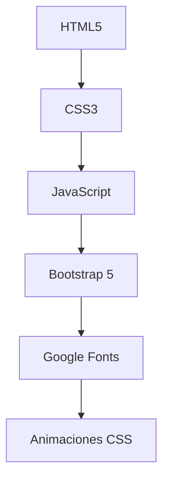

# 🎨 YoDibujo - Tu Guía Creativa para el Dibujo Artístico  

**Proyecto en evolución constante** ✏️✨  

## 📌 Descripción  

YoDibujo es una página web educativa que desarrollé originalmente en 2021 para el curso *"Mundo Digital"* de Junior Achievement Argentina. Actualmente estoy **rediseñando y mejorando** el proyecto para crear una experiencia más completa para aspirantes a artistas.

## 🌟 Características  

### 🎯 Actualmente Implementado  
✅ **Guías completas** sobre técnicas tradicionales y digitales  
✅ **Catálogo visual** de materiales y herramientas  
✅ **Ejemplos prácticos** con diferentes estilos artísticos  
✅ **Diseño responsive** usando Bootstrap 5  

### 🚀 En Progreso (2024)  
🔨 Rediseño de UI/UX con Figma  
🔨 Integración de más contenido interactivo  
🔨 Optimización del código heredado  

## 🛠 Stack Tecnológico  

## 🌱 Mi Filosofía de Desarrollo  

1. **Investigar** tendencias actuales en arte digital  
2. **Prototipar** en Figma antes de codificar  
3. **Implementar** con código limpio y semántico  
4. **Testear** con usuarios reales  

## 📬 Contacto  

📧 **Email**: [anapaulariosgarin@gmail.com](mailto:anapaulariosgarin@gmail.com)  

**⭐ ¡Dale una estrella al proyecto si te gusta!**  

---  

💡 *"El arte reside en los detalles... y a veces en los bugs creativos"*  

🖌️ **Desarrollado con pasión por** [Ana Paula Ríos Garín](https://github.com/tu-usuario)  

*Última actualización: Mayo 2025*
